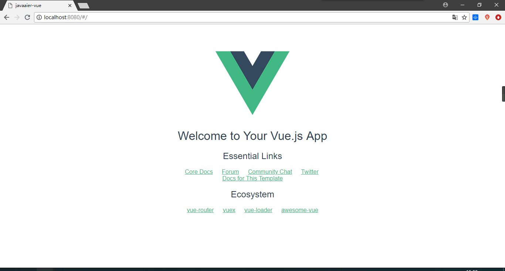

# Spring Boot + Vue 学习 01

参考：[Spring Boot+Vue从零开始搭建系统（一）：项目前端_Vuejs环境搭建](https://segmentfault.com/a/1190000013950461)

- 安装Node（并升级包管理器）

  ```powershell
  C:\WINDOWS\system32>node -v
  v10.15.0
  
  C:\WINDOWS\system32>npm -v
  6.4.1
  
  C:\WINDOWS\system32>npm -g install npm
  C:\Users\28137\AppData\Roaming\npm\npm -> C:\Users\28137\AppData\Roaming\npm\node_modules\npm\bin\npm-cli.js
  C:\Users\28137\AppData\Roaming\npm\npx -> C:\Users\28137\AppData\Roaming\npm\node_modules\npm\bin\npx-cli.js
  + npm@6.5.0
  added 389 packages from 781 contributors in 36.499s
  
  C:\WINDOWS\system32>npm -v
  6.5.0
  
  C:\WINDOWS\system32>npm install -g cnpm --registry=https://registry.npm.taobao.org
  npm WARN deprecated socks@1.1.10: If using 2.x branch, please upgrade to at least 2.1.6 to avoid a serious bug with socket data flow and an import issue introduced in 2.1.0
  C:\Users\28137\AppData\Roaming\npm\cnpm -> C:\Users\28137\AppData\Roaming\npm\node_modules\cnpm\bin\cnpm
  + cnpm@6.0.0
  added 637 packages from 856 contributors in 77.314s
  ```

- cnpm安装脚手架vue-cli

  ```powershell
  C:\WINDOWS\system32>cnpm install -g vue-cli
  Downloading vue-cli to C:\Users\28137\AppData\Roaming\npm\node_modules\vue-cli_tmp
  Copying C:\Users\28137\AppData\Roaming\npm\node_modules\vue-cli_tmp\_vue-cli@2.9.6@vue-cli to C:\Users\28137\AppData\Roaming\npm\node_modules\vue-cli
  Installing vue-cli's dependencies to C:\Users\28137\AppData\Roaming\npm\node_modules\vue-cli/node_modules
  [1/20] commander@^2.9.0 installed at node_modules\_commander@2.19.0@commander
  [2/20] multimatch@^2.1.0 installed at node_modules\_multimatch@2.1.0@multimatch
  [3/20] minimatch@^3.0.0 installed at node_modules\_minimatch@3.0.4@minimatch
  [4/20] ora@^1.3.0 installed at node_modules\_ora@1.4.0@ora
  [5/20] rimraf@^2.5.0 existed at node_modules\_rimraf@2.6.3@rimraf
  [6/20] chalk@^2.1.0 installed at node_modules\_chalk@2.4.1@chalk
  [7/20] semver@^5.1.0 installed at node_modules\_semver@5.6.0@semver
  [8/20] consolidate@^0.14.0 installed at node_modules\_consolidate@0.14.5@consolidate
  [9/20] uid@0.0.2 installed at node_modules\_uid@0.0.2@uid
  [10/20] read-metadata@^1.0.0 installed at node_modules\_read-metadata@1.0.0@read-metadata
  [11/20] user-home@^2.0.0 installed at node_modules\_user-home@2.0.0@user-home
  [12/20] tildify@^1.2.0 installed at node_modules\_tildify@1.2.0@tildify
  [13/20] coffee-script@1.12.7 existed at node_modules\_coffee-script@1.12.7@coffee-script
  [14/20] validate-npm-package-name@^3.0.0 installed at node_modules\_validate-npm-package-name@3.0.0@validate-npm-package-name
  [15/20] metalsmith@^2.1.0 installed at node_modules\_metalsmith@2.3.0@metalsmith
  [16/20] handlebars@^4.0.5 installed at node_modules\_handlebars@4.0.12@handlebars
  [17/20] request@^2.67.0 installed at node_modules\_request@2.88.0@request
  [18/20] async@^2.4.0 installed at node_modules\_async@2.6.1@async
  [19/20] download-git-repo@^1.0.1 installed at node_modules\_download-git-repo@1.1.0@download-git-repo
  [20/20] inquirer@^6.0.0 installed at node_modules\_inquirer@6.2.1@inquirer
  deprecate metalsmith@2.3.0 › gray-matter@2.1.1 › coffee-script@^1.12.4 CoffeeScript on NPM has moved to "coffeescript" (no hyphen)
  Recently updated (since 2018-12-28): 1 packages (detail see file C:\Users\28137\AppData\Roaming\npm\node_modules\vue-cli\node_modules\.recently_updates.txt)
    2019-01-03
      → metalsmith@2.3.0 › rimraf@^2.2.8(2.6.3) (03:26:12)
  All packages installed (238 packages installed from npm registry, used 20s(network 20s), speed 259.76kB/s, json 222(392.24kB), tarball 4.7MB)
  [vue-cli@2.9.6] link C:\Users\28137\AppData\Roaming\npm\vue@ -> C:\Users\28137\AppData\Roaming\npm\node_modules\vue-cli\bin\vue
  [vue-cli@2.9.6] link C:\Users\28137\AppData\Roaming\npm\vue-init@ -> C:\Users\28137\AppData\Roaming\npm\node_modules\vue-cli\bin\vue-init
  [vue-cli@2.9.6] link C:\Users\28137\AppData\Roaming\npm\vue-list@ -> C:\Users\28137\AppData\Roaming\npm\node_modules\vue-cli\bin\vue-list
  
  C:\WINDOWS\system32>
  ```


- 创建vue实验目录

  ```powershell
  
  C:\WINDOWS\system32>cd D:\rj
  
  C:\WINDOWS\system32>D:
  
  D:\rj>mkdir vue-workspace
  
  D:\rj>cd vue-workspace
  ```


- 创建vue项目

```bash
D:\rj\vue-workspace>vue init webpack javaaier-vue

? Project name javaaier-vue
? Project description a step to learn how to add vue on spring boot project
? Author javaaier
? Vue build standalone
? Install vue-router? Yes
? Use ESLint to lint your code? No
? Set up unit tests No
? Setup e2e tests with Nightwatch? No
? Should we run `npm install` for you after the project has been created? (recommended) npm

   vue-cli · Generated "javaaier-vue".


# Installing project dependencies ...
# ========================

npm WARN deprecated browserslist@2.11.3: Browserslist 2 could fail on reading Browserslist >3.0 config used in other tools.
npm WARN deprecated bfj-node4@5.3.1: Switch to the `bfj` package for fixes and new features!
npm WARN deprecated browserslist@1.7.7: Browserslist 2 could fail on reading Browserslist >3.0 config used in other tools.

> uglifyjs-webpack-plugin@0.4.6 postinstall D:\rj\vue-workspace\javaaier-vue\node_modules\webpack\node_modules\uglifyjs-webpack-plugin
> node lib/post_install.js

npm notice created a lockfile as package-lock.json. You should commit this file.
npm WARN ajv-keywords@3.2.0 requires a peer of ajv@^6.0.0 but none is installed. You must install peer dependencies yourself.
npm WARN optional SKIPPING OPTIONAL DEPENDENCY: fsevents@1.2.4 (node_modules\fsevents):
npm WARN notsup SKIPPING OPTIONAL DEPENDENCY: Unsupported platform for fsevents@1.2.4: wanted {"os":"darwin","arch":"any"} (current: {"os":"win32","arch":"x64"})

added 1130 packages from 650 contributors and audited 10654 packages in 125.466s
found 2 vulnerabilities (1 moderate, 1 high)
  run `npm audit fix` to fix them, or `npm audit` for details

# Project initialization finished!
# ========================

To get started:

  cd javaaier-vue
  npm run dev

Documentation can be found at https://vuejs-templates.github.io/webpack


D:\rj\vue-workspace>
```

- 安装项目依赖

  ```bash
  D:\rj\vue-workspace>cd javaaier-vue
  
  D:\rj\vue-workspace\javaaier-vue>cnpm install
  √ Installed 37 packages
  √ Linked 0 latest versions
  √ Run 0 scripts
  √ All packages installed (used 51ms(network 41ms), speed 0B/s, json 0(0B), tarball 0B)
  
  D:\rj\vue-workspace\javaaier-vue>
  
  ```

- 运行项目

  ```bash
  D:\rj\vue-workspace\javaaier-vue>npm run dev
  
  > javaaier-vue@1.0.0 dev D:\rj\vue-workspace\javaaier-vue
  > webpack-dev-server --inline --progress --config build/webpack.dev.conf.js
  
   95% emitting
  
   DONE  Compiled successfully in 5616ms                                                                          14:59:09
  
   I  Your application is running here: http://localhost:8080
  ```

  

