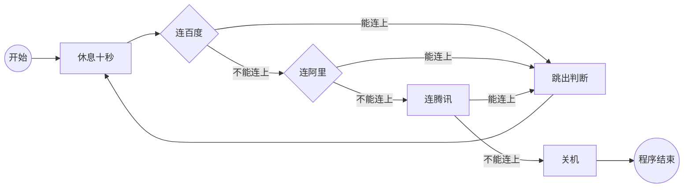
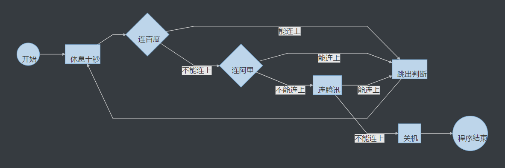
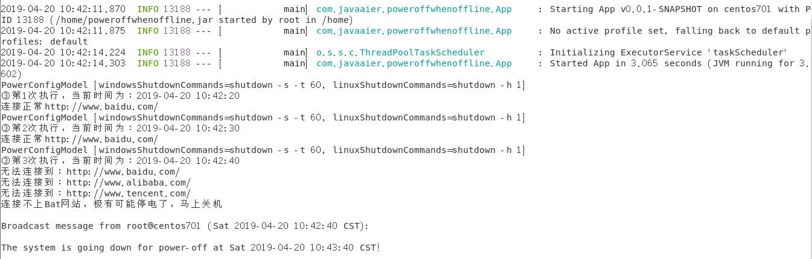

[TOC]

## 代码背景

最近组了一个小主机+向日葵路由器来实现外网文件系统，为防止家里nas意外断电（可用性有99.9999%，也还是怕万一），如果断网就关机，防止ups电耗光将磁盘损坏（同理，怕万一）。

### 流程图





### 代码运行效果

> sudo java -jar -Dspring.config.location=application.properties poweroffwhenoffline.jar



## 获取操作系统类型

### [Java 判断操作系统类型适用于各种操作系统  ](<https://blog.csdn.net/isea533/article/details/8449919>)

``` java 
//EPlatform.java
/**
 * 平台
 * @author isea533
 */
public enum EPlatform {
	Any("any"),
	Linux("Linux"),
	Mac_OS("Mac OS"),
	Mac_OS_X("Mac OS X"),
	Windows("Windows"),
	OS2("OS/2"),
	Solaris("Solaris"),
	SunOS("SunOS"),
	MPEiX("MPE/iX"),
	HP_UX("HP-UX"),
	AIX("AIX"),
	OS390("OS/390"),
	FreeBSD("FreeBSD"),
	Irix("Irix"),
	Digital_Unix("Digital Unix"),
	NetWare_411("NetWare"),
	OSF1("OSF1"),
	OpenVMS("OpenVMS"),
	Others("Others");
	
	private EPlatform(String desc){
		this.description = desc;
	}
	
	public String toString(){
		return description;
	}
	
	private String description;
}
```

``` java
//OSinfo
/**
 * 操作系统类：
 * 获取System.getProperty("os.name")对应的操作系统
 * @author isea533
 */
public class OSinfo {
	
	private static String OS = System.getProperty("os.name").toLowerCase();
	
	private static OSinfo _instance = new OSinfo();
	
	private EPlatform platform;
	
	private OSinfo(){}
	
	public static boolean isLinux(){
		return OS.indexOf("linux")>=0;
	}
	
	public static boolean isMacOS(){
		return OS.indexOf("mac")>=0&&OS.indexOf("os")>0&&OS.indexOf("x")<0;
	}
	
	public static boolean isMacOSX(){
		return OS.indexOf("mac")>=0&&OS.indexOf("os")>0&&OS.indexOf("x")>0;
	}
	
	public static boolean isWindows(){
		return OS.indexOf("windows")>=0;
	}
	
	public static boolean isOS2(){
		return OS.indexOf("os/2")>=0;
	}
	
	public static boolean isSolaris(){
		return OS.indexOf("solaris")>=0;
	}
	
	public static boolean isSunOS(){
		return OS.indexOf("sunos")>=0;
	}
	
	public static boolean isMPEiX(){
		return OS.indexOf("mpe/ix")>=0;
	}
	
	public static boolean isHPUX(){
		return OS.indexOf("hp-ux")>=0;
	}
	
	public static boolean isAix(){
		return OS.indexOf("aix")>=0;
	}
	
	public static boolean isOS390(){
		return OS.indexOf("os/390")>=0;
	}
	
	public static boolean isFreeBSD(){
		return OS.indexOf("freebsd")>=0;
	}
	
	public static boolean isIrix(){
		return OS.indexOf("irix")>=0;
	}
	
	public static boolean isDigitalUnix(){
		return OS.indexOf("digital")>=0&&OS.indexOf("unix")>0;
	}
	
	public static boolean isNetWare(){
		return OS.indexOf("netware")>=0;
	}
	
	public static boolean isOSF1(){
		return OS.indexOf("osf1")>=0;
	}
	
	public static boolean isOpenVMS(){
		return OS.indexOf("openvms")>=0;
	}
	
	/**
	 * 获取操作系统名字
	 * @return 操作系统名
	 */
	public static EPlatform getOSname(){
		if(isAix()){
			_instance.platform = EPlatform.AIX;
		}else if (isDigitalUnix()) {
			_instance.platform = EPlatform.Digital_Unix;
		}else if (isFreeBSD()) {
			_instance.platform = EPlatform.FreeBSD;
		}else if (isHPUX()) {
			_instance.platform = EPlatform.HP_UX;
		}else if (isIrix()) {
			_instance.platform = EPlatform.Irix;
		}else if (isLinux()) {
			_instance.platform = EPlatform.Linux;
		}else if (isMacOS()) {
			_instance.platform = EPlatform.Mac_OS;
		}else if (isMacOSX()) {
			_instance.platform = EPlatform.Mac_OS_X;
		}else if (isMPEiX()) {
			_instance.platform = EPlatform.MPEiX;
		}else if (isNetWare()) {
			_instance.platform = EPlatform.NetWare_411;
		}else if (isOpenVMS()) {
			_instance.platform = EPlatform.OpenVMS;
		}else if (isOS2()) {
			_instance.platform = EPlatform.OS2;
		}else if (isOS390()) {
			_instance.platform = EPlatform.OS390;
		}else if (isOSF1()) {
			_instance.platform = EPlatform.OSF1;
		}else if (isSolaris()) {
			_instance.platform = EPlatform.Solaris;
		}else if (isSunOS()) {
			_instance.platform = EPlatform.SunOS;
		}else if (isWindows()) {
			_instance.platform = EPlatform.Windows;
		}else{
			_instance.platform = EPlatform.Others;
		}
		return _instance.platform;
	}
	/**
	 * @param args
	 */
	public static void main(String[] args) {
		System.out.println(OSinfo.getOSname());
	}
 
}
```

``` java
//WhatOS
class WhatOS 
{
  public static void main( String args[] ) 
  {
    System.out.println( System.getProperty("os.name") );
    System.out.println( System.getProperty("os.version") );
    System.out.println( System.getProperty("os.arch") );
  }
}
```


### [利用SpringBoot项目查看系统属性系统名称、系统内存、线程等  ](<https://blog.csdn.net/qq_29384639/article/details/81266943>)

项目启动后浏览器访问http://localhost:8080/env

浏览器访问http://localhost:8080/metrics

浏览器访问http://localhost:8080/metrics/mem.free可以更细粒度地获取度量信息

浏览器访问http://localhost:8080/health可获取各类健康指标信息

[Spring Boot 实现定时任务](<https://blog.csdn.net/qq_37380557/article/details/72723998>)

``` java
/** 
* 定时任务 
* @author Liz 
* 2017-05-25 
*/ 
@Component 
@EnableScheduling 
@Service
@Transactional
public class ScheduledTaskService {
 
	/**
	 * 目标：实现定时任务；实例中是每隔3秒钟执行一次
	 */
	
	private Integer count_first = 1;
	private Integer count_second = 1;
	private Integer count_three = 1;
	
	@Scheduled(fixedRate = 10000)
	public void printCurrentTime() throws InterruptedException {
	    System.out.println(String.format("① 第%s次执行，当前时间为：%s", count_first++, dateFormat.format(new Date())));
	}
	
	@Scheduled(fixedDelay = 10000)
	public void printCurrentTimeAfterSleep() throws InterruptedException {
	    System.out.println(String.format("② 第%s次执行，当前时间为：%s", count_second++, dateFormat.format(new Date())));
	}
	
	@Scheduled(cron = "*/10 * * * * *")
	public void printCurrentTimeCron() throws InterruptedException {
	    System.out.println(String.format("③ 第%s次执行，当前时间为：%s", count_three++, dateFormat.format(new Date())));
	}
	
	private static final SimpleDateFormat dateFormat = new SimpleDateFormat("yyyy-MM-dd HH:mm:ss");
	
} 
```

``` xml
<!-- https://mvnrepository.com/artifact/org.quartz-scheduler/quartz -->
<dependency>
<groupId>org.quartz-scheduler</groupId>
<artifactId>quartz</artifactId>
<version>2.2.3</version>
</dependency>
```


## Java关机

### [Java程序调用自动关机指令 1分钟内自动关机](https://www.cnblogs.com/qingyundian/p/7631869.html)

``` java
package com.swift;//可以不要这句

import java.io.IOException;

public class Shutdown100 {

    public static void main(String[] args) {
        try {
            Runtime.getRuntime().exec("shutdown -s -t 60");//其实就这一句 shutdown -r是重启
        } catch (IOException e) {
            e.printStackTrace();
        }
    }
}
```


## 判断网络是否连通

### [采纳：java中判断网络是否连通](https://www.cnblogs.com/moon-jiajun/p/3454576.html)

``` java
package com.cjj.client;

import java.io.IOException;
import java.io.InputStream;
import java.net.InetAddress;
import java.net.URL;

public class InetJavaTest {
    private static String remoteInetAddr = "59.231.36.59";//需要连接的IP地址
     /**
     * 传入需要连接的IP，返回是否连接成功
     * @param remoteInetAddr
     * @return
     */
    public static boolean isReachable(String remoteInetAddr) {
        boolean reachable = false; 
        try {   
            InetAddress address = InetAddress.getByName(remoteInetAddr); 
            reachable = address.isReachable(5000);  
            } catch (Exception e) {  
            e.printStackTrace();  
            }  
        return reachable;
    }
    
    public static void main(String[] args) {
        URL url = null;
        Boolean bon = false;
        try {
        url = new URL("http://baicu.com/");
        InputStream in = url.openStream();//打开到此 URL 的连接并返回一个用于从该连接读入的 InputStream
        System.out.println("连接正常");
        in.close();//关闭此输入流并释放与该流关联的所有系统资源。
        } catch (IOException e) {
        System.out.println("无法连接到：" + url.toString());
        }
        bon = isReachable(remoteInetAddr);
        System.out.println("pingIP：" + bon);
    }
}
```


### [不采纳：java通过ping 判断网络是否正常](https://www.cnblogs.com/cxxjohnson/p/7152840.html)

```java
import java.io.BufferedReader;    
import java.io.IOException;    
import java.io.InputStream;    
import java.io.InputStreamReader;    
     
/**  
 * 判断网络连接状况.  
 *  
 */   
public class NetState {    
     
    public boolean isConnect(){    
        boolean connect = false;    
        Runtime runtime = Runtime.getRuntime();    
        Process process;    
        try {    
            process = runtime.exec("ping " + "www.baidu.com");    
            InputStream is = process.getInputStream();     
            InputStreamReader isr = new InputStreamReader(is);     
            BufferedReader br = new BufferedReader(isr);     
            String line = null;     
            StringBuffer sb = new StringBuffer();     
            while ((line = br.readLine()) != null) {     
                sb.append(line);     
            }     
            System.out.println("返回值为:"+sb);      
            is.close();     
            isr.close();     
            br.close();     
     
            if (null != sb && !sb.toString().equals("")) {     
                String logString = "";     
                if (sb.toString().indexOf("TTL") > 0) {     
                    // 网络畅通      
                    connect = true;    
                } else {     
                    // 网络不畅通      
                    connect = false;    
                }     
            }     
        } catch (IOException e) {    
            e.printStackTrace();    
        }     
        return connect;    
    }    
         
    public static void main(String[] args) {    
        NetState netState = new NetState();    
        System.out.println(netState.isConnect());    
     
    }    
}
```


### [不采纳：java 实现监测电脑是否断开网络连接](https://www.iteye.com/problems/66096)

``` java
public static void main(String[] args) throws Exception {  
        String[] command = new String[] { "ipconfig", "/all" };  
        Process process = Runtime.getRuntime().exec(command);  
        InputStream is = process.getInputStream();  
        InputStreamReader inputStreamReader = new InputStreamReader(is, Charset.forName("GBK"));  
        BufferedReader reader = new BufferedReader(inputStreamReader);  
        for (String line = null; (line = reader.readLine()) != null; ) {  
            System.out.println(line);  
        }  
        reader.close();  
    }  
```

