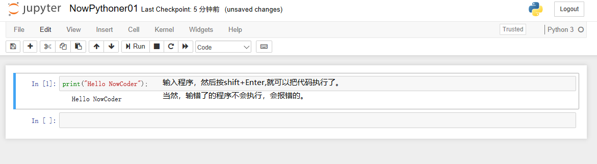

# 机器学习:Anaconda和JupyterNotebooks
## Anaconda笔记
```
# 列出环境下安装的python库
conda list
# 下面好长一页的库列表，反正我也不知道干嘛的，先跳过去。
# numpy pandasmatplotlibtensorflow等
# 安装一个Python库
conda install numpy 
# 查找某个Python库的各个版本：版本号、操作系统等信息
anaconda search -t conda tensorflow
# 查找一个python库的具体版本的信息
anaconda show anaconda/tensorflow
# 下面是返回消息
    Using Anaconda API: https://api.anaconda.org
Name:    tensorflow
Summary: TensorFlow is a machine learning library.
Access:  public
Package Types:  conda
Versions:
   + 0.10.0rc0
   + 1.0.1
   + 1.1.0
   + 1.2.1
   + 1.3.0
   + 1.4.1
   + 1.5.0
   + 1.6.0
   + 1.7.0
   + 1.7.1
   + 1.8.0
   + 1.9.0
   + 1.10.0
   + 1.11.0
   + 1.12.0
    To install this package with conda run:
     conda install --channel https://conda.anaconda.org/anaconda tensorflow
# 安装一个Python库的一个具体版本 
conda install --channel https://conda.anaconda.org/anaconda tensorflow
# 更新一个Python库到最新版本
conda update numpy
```

## Jupyter NoteBooks 笔记

*   点击开始菜单中的图标，打开
*   文件夹创建

    *   files
        *   [右侧]new --> folder
        *   在下面的列表中 按 last modified排序，找到[Untitled Folder]
        *   打勾，选中ta，然后rename
        *   输入 NowPython
        *   完成文件夹创建
            
*   文件创建

    *   点击 NowPython，进入文件夹
    *   [右侧]new --> Python 3-->自动弹出一个笔记页
    *   高级操作：rename --> NowPythoner01


*   你好世界
    